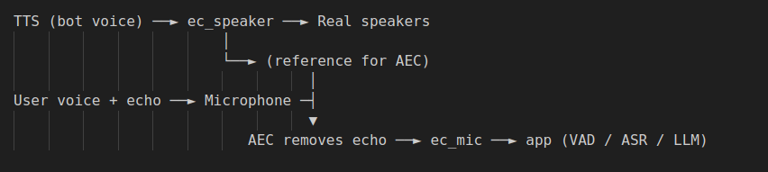

# 🧠 Conversational Bot

Private, local, low‑latency voice assistant with hotword detection, ASR, **streaming LLM → streaming TTS**, barge‑in, and a tidy `/vitals` dashboard.

---

## ✨ What’s implemented (and how)

* **Wake word with safe fallback** — Porcupine hotword; if it’s missing or fails, the app switches to **text‑based wake matching** without crashing.
* **ASR with clean endpointing** — Faster‑Whisper tuned for short turns; **standby** listens in tight windows; **active sessions** auto‑detect RO/EN (standby favors EN for reliable hotwords).
* **Streaming LLM → streaming TTS** — Real‑time token streaming to speech; **time‑to‑first‑token (TTFT)** is measured so replies feel snappy.
* **Audio hygiene** — System echo‑cancel (AEC), noise suppression, high‑pass filter; **AGC off** to avoid noise pumping & false VAD triggers.
* **No accidental “pa…” exits** — Session closes **only** on exact goodbyes (e.g., “ok bye”, “gata”, “la revedere”).
* **Observability** — Prometheus counters + a simple `/vitals` page for round‑trip, ASR, TTFT, sessions, turns, errors.
* **Double buffer for seamless TTS** — Prevents micro‑pauses when the bot speaks; while buffer A plays, buffer B synthesizes the next chunk, then they alternate continuously.
* **English <> Romanian** — Improved command & QA flow in English while keeping full Romanian support.
* **Honest fallback** — If the bot doesn’t know, it says so (“I’m not sure about that yet, but I can look it up if you’d like.”).

---

## 🔧 Practical setup for users (do this)

1. **Select the echo‑cancelled mic**
   Use the `ec_mic` input (see Linux commands below). This is critical so the bot doesn’t hear its own TTS as user speech.

2. **Tune thresholds for your room**

* `min_speech_duration`: **1.0–1.2s** (utterances shorter than this are ignored)
* `silence_to_end`: **1200–1500 ms** (only for *active* session end, not standby)
* Keep **AGC off** in the OS/driver and inside AEC if exposed.

3. **Keys & env**

* Put API keys in `.env`.
* **Note:** Activating a venv does **not** read `.env` automatically. Either:

  * use `python-dotenv` inside the app, or
  * `export $(grep -v '^#' .env | xargs)` in your shell before `python -m src.app`.

4. **Run with structured logs**

```bash
LOG_LEVEL=INFO LOG_DIR=logs python -m src.app
```

5. **(Optional) Hotword**
   Have a **Picovoice (Porcupine) key** for instant wake (“hello robot”). Without it, the fallback text matcher still works, just a bit less robust/low‑latency.

---

## 🧩 Mini flow (pipeline)

**Standby & Wake** → (Porcupine **or** text fallback)
→ **Acknowledgement** (“Yes, I’m listening.” / “Da, te ascult.”)
→ **Record & endpoint** (VAD on silence; AEC + NS + HPF; AGC off)
→ **ASR** (Faster‑Whisper; session auto RO/EN; standby favors EN)
→ **LLM** (streamed generation; **strict‑facts** mode to reduce hallucinations)
→ **TTS** (streamed **sentence chunks**)
→ **Double buffer** (A plays while B synthesizes; swap)
→ **Barge‑in** (if the user speaks, TTS stops; return to listening)
→ **Session end** (idle timeout **or** exact‑match goodbye)

---

## 🎙️ Audio Architecture (AEC explained)

**Goal:** prevent the bot’s own TTS from being mis‑detected as user speech.

**How:** WebRTC AEC uses an **adaptive filter** that estimates the **echo path** (the transformation from far‑end signal → what the mic would hear). With the **far‑end** signal (what we send to speakers) and the **near‑end** mic input, it continuously **predicts and subtracts** the echo component from the mic stream. This is *not* a static “room fingerprint”; it adapts in real time as the environment changes.

Extra guards we use:

* **Exact‑match goodbye only** (no partial “pa…” exits).
* **Audio similarity veto**: if incoming mic frames highly correlate with the last TTS frames, ignore them.
* **Voice‑only gating**: prioritize voiced segments for barge‑in (reduces knocks/claps).

---

## 🧪 Biggest build obstacles (and fixes)

* **Echo loop (bot hears itself)** → solved with **system‑level AEC** and selecting `ec_mic`, AGC off, plus TTS‑similarity veto.
* **False exits on “pa…”** → fixed via **exact‑match goodbyes** only.
* **TTS micro‑pauses** → fixed with **double buffering** (A plays while B synthesizes next chunk).
* **Noise‑triggered barge‑in** → improved by requiring **voiced segments** and raising the minimum speech duration.

> **BIGGEST OBSTACLE — reliable barge‑in**: now solid with **Cobra VAD**. It also works *without* Picovoice (using WebRTC VAD + thresholds), but Cobra is more robust.

---

## 🧰 Linux audio: create echo‑cancel devices (PulseAudio / PipeWire)

> Many modern distros run **PipeWire** with a PulseAudio compatibility layer. The commands below work in both setups if the PulseAudio modules are available.

```bash
# 1) Show current default sink/source
pactl info | sed -n -e 's/^Default Sink: /Default Sink: /p' -e 's/^Default Source: /Default Source: /p'

# 2) Unload any old echo-cancel (ignore errors if not loaded)
pactl unload-module module-echo-cancel 2>/dev/null || true

# 3) Load WebRTC echo-cancel on defaults
DEFAULT_SINK="$(pactl info | awk -F': ' '/Default Sink/{print $2}')"
DEFAULT_SOURCE="$(pactl info | awk -F': ' '/Default Source/{print $2}')"

pactl load-module module-echo-cancel \
  aec_method=webrtc \
  aec_args="analog_gain_control=0 digital_gain_control=0" \
  use_master_format=1 \
  sink_master="$DEFAULT_SINK" \
  source_master="$DEFAULT_SOURCE" \
  sink_name=ec_speaker \
  source_name=ec_mic

# 4) Make the echo-cancelled mic default
pactl set-default-source ec_mic

# 5) Verify
pactl list short sources | grep -Ei 'ec_mic|echo|cancel'
```

## 🔄 Models & reasoning

* **ASR**: Started with OpenAI Whisper, switched to **Faster‑Whisper** for lower latency on CPU.
* **LLM**: Started on **Llama** (strong bilingual all‑rounder), then tested **Qwen‑2.5 3B Instruct**. Keep a small, fast model for latency; pick based on your device.
* **TTS**: Prefer **Piper** (fast, local). Fallback to `pyttsx3` if needed.
* **Containerization**: Packaging everything in a container can give a **big reliability boost** (consistent deps, easy startup scripts), but is optional.
* **“Teaser while thinking”**: Considered a two‑brain approach (quick TL;DR line while the full answer loads). Dropped due to complexity vs. small latency benefit (most hard questions fit in ~3s extra).

---

## 🗜️ Barge‑in reliability (with and without Picovoice)

* **Works without Picovoice**: WebRTC VAD + tuned thresholds can pause TTS when a *human voice* is detected.
* **Better with Picovoice**: **Cobra VAD** is more robust to noise; **Porcupine** gives instant “hello robot” wake.
* If you don’t have keys, the app falls back to text matching for wake and to WebRTC VAD for barge‑in.

**Pro‑tips**

* Raise `min_speech_duration` to avoid coughs/knocks.
* Use voiced‑only gating for barge‑in.
* Always select the **`ec_mic`** input.

---

## 🧠 LLM prompt (edit to your goals)

Update `configs/llm.yaml` to reflect your assistant’s role. Example fields worth tuning:

* **system**: persona, safety rails, bilingual tone
* **tools**: what the model may call
* **style**: concise vs. exploratory
* **facts mode**: stricter for correctness

---

## 🛠️ Commands recap

* **Run app with logs**

```bash
LOG_LEVEL=INFO LOG_DIR=logs python -m src.app

```

* **Load simple AEC setup** (see full commands above)
* **Set default mic to `ec_mic`**
* **Verify**: `pactl list short sources | grep -Ei 'ec_mic|echo|cancel'`

---

## 🔜 To‑do (next iterations)

* **Instant feedback while thinking** — quick filler like “Thanks — give me a sec…” if the first token is slow, then continue streaming the real answer.
* **Model bake‑off** — compare **Phi‑3 Mini (3.8B)** vs **Qwen‑2.5 (3B)** vs current **Llama**; choose based on latency, fluency, and bilingual accuracy.

---

## 📸 Vitals & diagram placeholders




