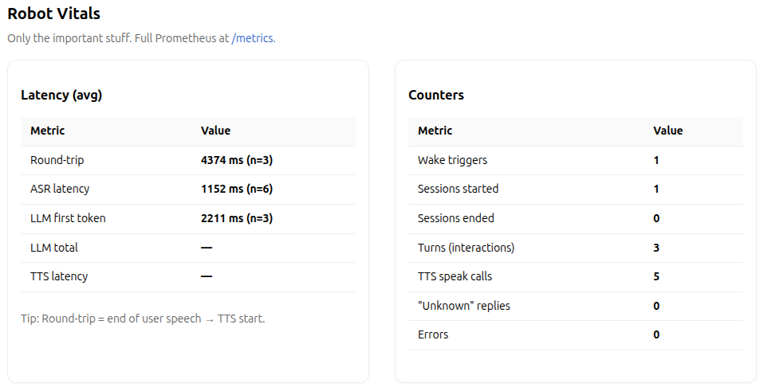

# 🧠 Conversational Bot

Private, local, low-latency voice assistant with hotword detection, ASR, **streaming LLM → streaming TTS**, barge-in, and a tidy `/vitals` dashboard.

---

## ✨ What’s implemented (and how)

- **Wake word with safe fallback** — Porcupine hotword; if it’s missing or fails, the app switches to **text-based wake matching** without crashing.  
- **ASR with clean endpointing** — Faster-Whisper tuned for short turns; **standby** listens in tight windows; **active sessions** auto-detect RO/EN (standby prefers EN for reliable hotwords).  
- **Streaming LLM → streaming TTS** — Real-time token streaming to speech; **time-to-first-token** measured so replies feel snappy.  
- **Audio hygiene** — System echo-cancel (AEC), noise suppression, high-pass filter; **AGC off** to avoid noise pumping & false VAD triggers.  
- **No accidental “pa…” exits** — Session closes **only** on exact goodbyes (e.g., “ok bye”, “gata”, “la revedere”).  
- **Observability** — Prometheus counters + a simple `/vitals` page for round-trip, ASR, TTFB, sessions, turns, errors.  
- **Double buffer for seamless TTS** — Prevents micro-pauses when the bot speaks; while buffer A is playing, buffer B preloads the next chunk, enabling smooth, uninterrupted speech.  
- **Better English understanding** — Improved command and QA flow in English-focused mode while keeping full Romanian support.  
- **Consistent fallback behavior** — When the bot doesn’t know something, it politely admits it (“I’m not sure about that yet, but I can look it up if you’d like.”).  

---

## 🔜 To-do (next iterations)

- **Barge-in (human-voice only)** — tighten gating so knocks/claps don’t interrupt; focus on voiced-only detection + slightly higher voice-duration thresholds.  
- **Instant feedback while thinking** — quick filler like “Thanks — give me a sec…” if the first token is slow, then continue streaming the real answer.  
- **Model bake-off** — compare **Phi-3 Mini (3.8B)** vs **Qwen-2.5 (3B)** vs current **Llama**; choose based on latency, fluency, and bilingual accuracy.  
- **Clear code docs** — concise docstrings and architecture notes per module.  
- **More natural TTS streaming** — make generation flow more stable (no abrupt stops mid-sentence; prefer steady 5-word rhythm).  

---

## 🧩 Mini flow (pipeline)

**Standby & Wake** → (Porcupine **or** text fallback)  
→ **Acknowledgement** (“Yes, I’m listening.” / “Da, te ascult.”)  
→ **Record & endpoint** (VAD on silence; AEC + NS + HPF; AGC off)  
→ **ASR** (Faster-Whisper; session auto RO/EN; standby favors EN)  
→ **LLM** (streamed generation; **strict-facts** mode to avoid hallucinations)  
→ **TTS** (streamed **sentence chunks**; Piper preferred, pyttsx3 fallback)  
→ **Double buffer** (alternate A/B audio buffers to ensure no pause mid-speech)  
→ **Barge-in** (if user speaks, TTS stops; return to listening)  
→ **Session end** (idle timeout **or** exact-match goodbye)

---

## 🧪 Biggest build obstacles (and fixes)

- **Echo loop (bot hears itself)** → solved with **system-level echo cancellation (AEC)**, selecting the `ec_mic` input device, keeping **AGC off**, and ignoring inputs that match the last bot reply (>85% similarity).  
- **False exits on “pa…”** → fixed by switching to **exact-match goodbye phrases only**.  
- **TTS micro-pauses** → fixed using **double buffering** (buffer A plays while buffer B synthesizes the next chunk, alternating continuously).  
- **Noise-based barge-in triggers** → still open (see To-do #1).

---

## ⚙️ Audio Architecture (AEC explanation)

The assistant uses **WebRTC echo cancellation** to avoid detecting its own voice (TTS) as user speech.

TTS (bot voice) ──► ec_speaker ──► Real speakers
                        │
                        └──► (reference for AEC)
                                  │
User voice + echo ──► Microphone ─┤
                                  ▼  
                           AEC removes echo ──► ec_mic ──► app (VAD / ASR / LLM)

                           

## 📊 Vitals screenshot

This setup:
- learns the **acoustic fingerprint** of the room,
- uses both the far-end (what’s playing) and near-end (what mic hears),
- and dynamically subtracts predicted echo from the mic input.

---

## 🧰 Commands (Linux / PulseAudio)

To create virtual echo-cancel devices (`ec_speaker`, `ec_mic`):

# 1️⃣ Find default sink/source
pactl info | sed -n -e 's/^Default Sink: /Default Sink: /p' -e 's/^Default Source: /Default Source: /p'

# 2️⃣ Unload any old echo-cancel module
pactl unload-module module-echo-cancel 2>/dev/null || true

# 3️⃣ Load WebRTC echo-cancel on defaults
DEFAULT_SINK="$(pactl info | awk -F': ' '/Default Sink/{print $2}')"
DEFAULT_SOURCE="$(pactl info | awk -F': ' '/Default Source/{print $2}')"

pactl load-module module-echo-cancel \
  aec_method=webrtc \
  aec_args="analog_gain_control=1 digital_gain_control=1" \
  use_master_format=1 \
  sink_master="$DEFAULT_SINK" \
  source_master="$DEFAULT_SOURCE" \
  sink_name=ec_speaker \
  source_name=ec_mic

# 4️⃣ Set ec_mic as default mic
pactl set-default-source ec_mic

# 5️⃣ Verify
pactl list short sources | grep -Ei 'ec_mic|echo|cancel'
